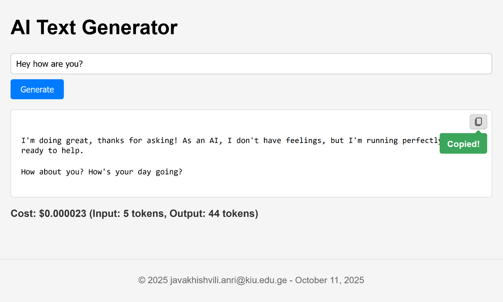

# AI Text Generator - Homework 1

## Author

Gvantsa Thuradze 
## Final Product Screenshot



## Features Implemented

### 1. Streaming Text Display

- **Description:** I updated my `generateTextStreaming` function to use the `:streamGenerateContent` endpoint with the `?alt=sse` parameter. My code now processes the response as a stream of Server-Sent Events (SSE), parsing each data chunk that starts with "data: ". The text is extracted from the JSON response and appended to the output area in real-time using `marked.parse()` for markdown rendering. I implemented a buffer system to handle incomplete JSON chunks that may arrive mid-stream, ensuring reliable parsing of all streamed content.

### 2. Detailed Cost Display

- **Description:** After the stream is complete, I parse the `usageMetadata` from the API response chunks. I capture both `promptTokenCount` and `candidatesTokenCount` from the metadata object. I then update the DOM to display the input tokens, output tokens, and the total calculated cost using the pricing formula (Input: $0.00025 per 1K tokens, Output: $0.0005 per 1K tokens). The cost display shows the format: "Cost: $X.XXXXXX (Input: X tokens, Output: X tokens)" with proper decimal precision.

### 3. Copy to Clipboard Button

- **Description:** I added a "Copy" button positioned at the top-right corner of the output container using absolute positioning. An event listener on this button uses the `navigator.clipboard.writeText()` method to copy the text content of the output area. Upon successful copy, a green tooltip appears below the button displaying "Copied!" with a speech-bubble style triangle pointer. The tooltip automatically disappears after 2 seconds. The button includes an SVG icon loaded from the public folder for a professional appearance.

### 4. Personalized Footer

- **Description:** I added a footer to the application using a `<footer>` element with the class "footer". I wrote a JavaScript function called `getCurrentDate()` in `script.js` that runs when the page loads to dynamically generate the current date using `new Date()` and format it using `toLocaleDateString()` with options for long-form month display. The footer displays my KIU email address (Tchuradze.gvantsa@kiu.edu.ge) along with the copyright symbol, current year, and dynamically generated date in the format:  - October 11, 2025".

## How to Run This Project

1. Clone this repository.
2. Create a `.env` file in the project root and add your Gemini API key: `VITE_AI_API_KEY="your-api-key-here"`
3. Install dependencies: `npm install` or `bun install`
4. Run the development server: `npm run dev` or `bun run dev`
5. Open the URL shown in the terminal (typically `http://localhost:5173`) in your browser.

## Technologies Used

- Vite - Build tool and development server
- JavaScript (ES6+) - Core programming language
- Gemini API - AI text generation
- Marked.js - Markdown rendering
- CSS3 - Styling and animations

## Project Structure

```
builder-sprint-app2/
├── public/
│   └── copy.svg
├── src/
│   ├── main.js          # Entry point, DOM setup
│   ├── script.js        # Core logic and API calls
│   └── style.css        # Styling
├── index.html
├── package.json
├── .env
└── README.md
```
